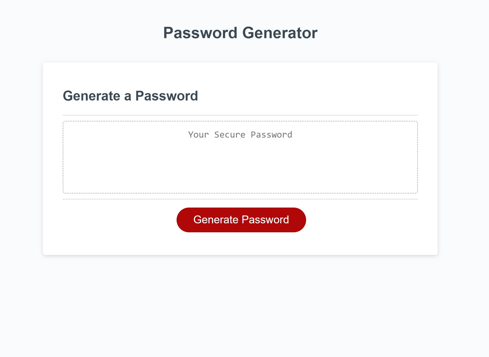
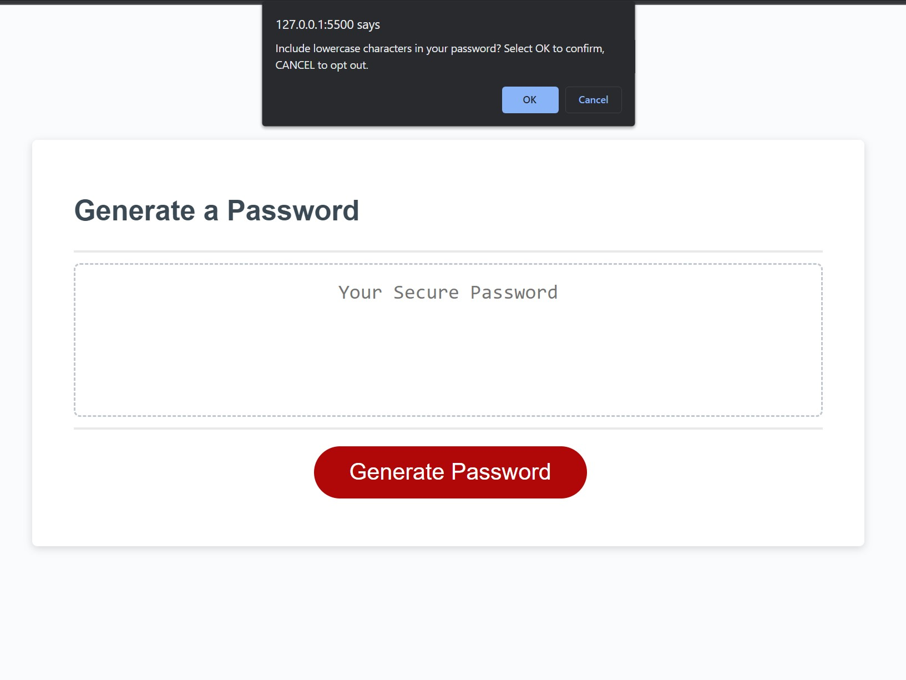
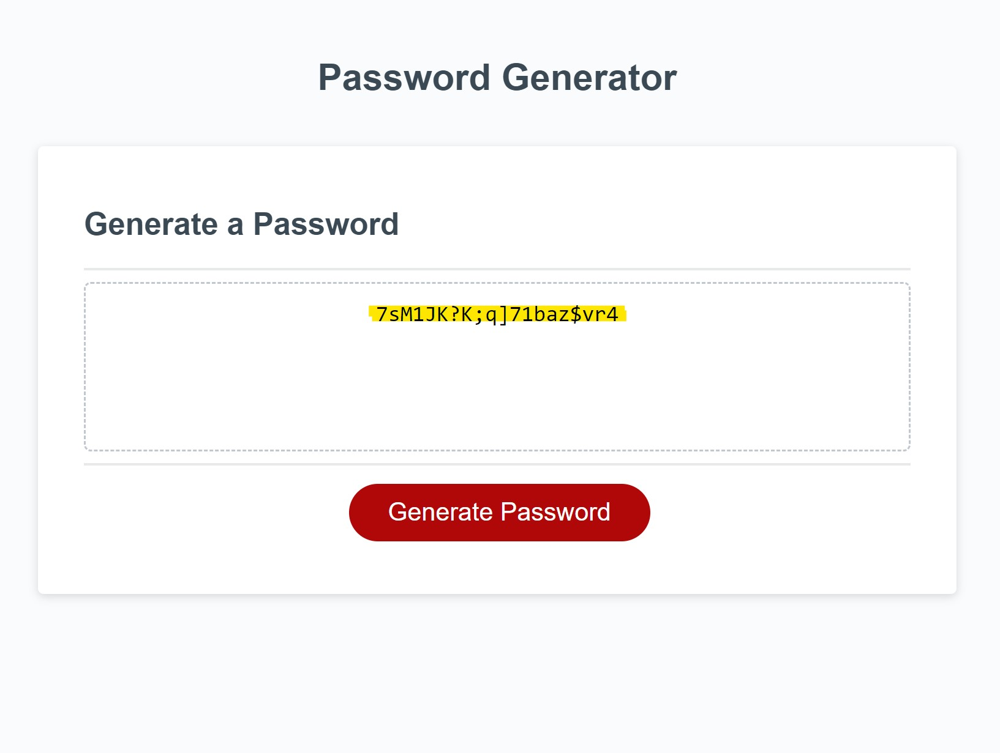

# random-password-generator
This is an application that will generate a random password under specified parameters outlined by a user. It is an app an employee can use to generate 
a random password based on criteria they've selected. This app will run in the browser, and will feature dynamically updated HTML and CSS powered by 
JavaScript. It will have a clean and polished user interface that is responsive, ensuring that it adapts to multiple screen sizes.

## User Story

```
AS AN employee with access to sensitive data
I WANT to randomly generate a password that meets certain criteria
SO THAT I can create a strong password that provides greater security
```

## Acceptance Criteria

```
GIVEN I need a new, secure password
WHEN I click the button to generate a password
THEN I am presented with a series of prompts for password criteria
WHEN prompted for password criteria
THEN I select which criteria to include in the password
WHEN prompted for the length of the password
THEN I choose a length of at least 8 characters and no more than 128 characters
WHEN asked for character types to include in the password
THEN I confirm whether or not to include lowercase, uppercase, numeric, and/or special characters
WHEN I answer each prompt
THEN my input should be validated and at least one character type should be selected
WHEN all prompts are answered
THEN a password is generated that matches the selected criteria
WHEN the password is generated
THEN the password is either displayed in an alert or written to the page
```

## Links
Below is a link to the deployed application via GitHub:

https://jmpre28.github.io/random-password-generator/

## Examples
1. A user can see this page upon initial load, and can click "Generate Password" to begin.



2. After clicking generate, the user is given a series of promtps to define the parameters of the password.



3. Once all prompts are answered, a password will then be generated for the user using given parameters.




### Week 3 challenge of the UofU coding bootcamp.
